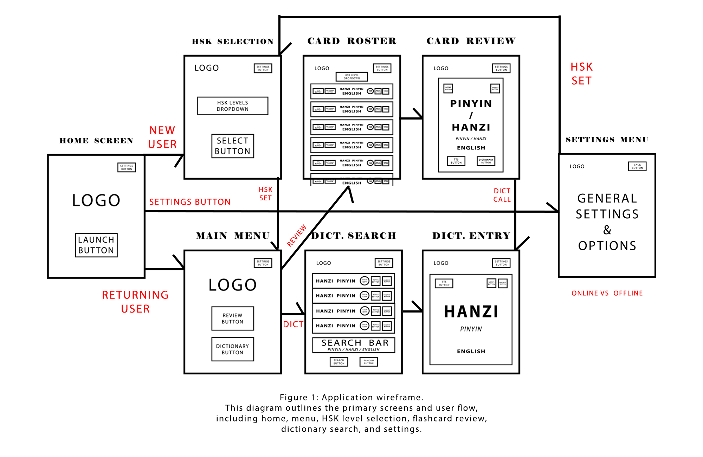

- [Project Description](#project-description)  
- [Foreword](#foreword)  
- [Versions](#versions)  
- [Platform Information](#platform-information)  
- [Front / Back Support](#frontback-support)  
- [Present Functionality](#present-functionality)  
- [Design](#design)
- [Credits & License](#credits--license)

# 📄 我的 快速 HSK / MyQuickHSK (_README / WIKI_)
### _HAND-SELECTED, HSK LEVEL-VARIABLE, CUSTOMIZABLE STUDY CARD DIGITAL SERVICE_

## PROJECT DESCRIPTION

This Android application provides Mandarin learners with an optionally-offlineable, self-tailorable review and dictionary service.  Users can select their HSK level and then, at a minimum, customize review vocabulary via easy-to-use flipcards; and, optionally, download locally, onto their device, a searchable database with 100,000+ characters (especially handy when needing access to characters offline).  The app integrates external data via complimentary GitHub filehosting (in lieu of an for-profit API) — which, data can be ported to a local Room (Android) database, on-device, ensuring the user's preferred state persistence.

## FOREWORD

Many students struggle to access structured Mandarin vocabulary tailored to their level; existing apps are often subscription-based and/or lack [any] customization.  This project provides a free, simple, customizable alternative where learners can study HSK-aligned vocabulary and expand their deck with personal notes.  This project is built with inspiration from the developer's own, personal journey into learning Mandarin and having issues with QoL (Quality of Life) features across different language learning apps.  Though this is not a commercial product, it is a project satisfying not only banal requirements for a University semester project as an illustrative learning example, but, also, the developer's own vestedly-interested wants concerning language-learning.  Future versions will, undoubtedly, continually interate moving forward; as, the project aims for top marks both academic _and_ serviceable in the Mobile Application market; so, why not provide the service, indefinitely, adding features as leisure allows?

## VERSIONS
The first iteration of this service aims to provide a TTS-centric (Text-to-Speech), litely-gamified personalized review and notation service coupled with quick-access to what is often considered the gold standard of Chinese character collections (CC-CEDICT).  Future versions need center around phrasebuilding; grammar and context learning; audiovisual samples and reviews; AI and live partner speech practice; and beyond.

#

### <ins>VERSION 1.0 FEATURES</ins>
-  _Hand-Chosen HSK Level Character Sets_
-  _TTS (Text-to-Speech) Dictionary (100K+ character set)_
-  _Review Cards (w/ Favorites & Bests System)_
-  _Gamified HSK-level Unlock system (optional)_
-  _Digital Notebook (per-card; in-app)_
-  _UI Theme Customization  (Light / Dark; Theme Color Variants)_
-  _Online & Offline General Access Options_

## PLATFORM INFORMATION
### ANDROID

IDE: _Android Studio_ (latest stable release)

Language: _Java_

### FRONT/BACK SUPPORT

Front-End (User-Facing):
-  Activities for menu, flashcards, and search
-  XML layouts for UI (RecyclerView for card lists)

Back-End (Data-Handling):
-  JSON vocab lists hosted on GitHub (akin to API endpoint)
-  Room database for local storage, persistence, and CRUD operations

## PRESENT FUNCTIONALITY
-  _HSK Level Selection_: Choose between HSK-1, HSK-2, HSK-3 lists.
-  _Search_: Look up words across all levels via dictionary.
-  _TTS (Text-to-Speech)_: Hear pronunciation using Android’s TextToSpeech service.
-  _Flashcard Review_: Browse and flip study cards.
-  _Select Favorites_: Save and notate personal flashcards.
-  _Persistence_: Dictionary levels (optional) and user cards locally saveable via Room DB.

## DESIGN

(<ins>**NOTE**</ins> — _Wireframe presented in simple schematic format to highlight flow and functionality. Final layouts may vary._)

### Design Notes
Native Unicode glyphs were chosen as part of design philosophy:  This service stresses functional accessibility and lack of bloat is part of guaranteeing access.  我的 快速 HSK should be able to run on all devices Android 4.4 (KitKat) and later; this way, even the user's old "potato" phone — lying around, collecting dust — can be repurposed into a pocket Chinese dictionary (e.g.  in the event of not being able to use one's main device[s]).

## CREDITS & LICENSE
### _Credits_:
Built by _Ethan G._ for SAINT LEO UNIVERSITY, COM-437-OL01 — "Mobile Application Development" graded homework project [FALL 2025 course section]
### _Data Sources_:
CC-CEDICT (public domain); curated HSK lists (_Ethan G._ via open educational resources); native emojis (Android builtins)

## RELEASE OF CLAIMS / DISCLAIMER
This project — including all code, design, documentation, and related intellectual property — is created and privately owned solely by the author _Ethan G._

SAINT LEO UNIVERSITY, its faculty, staff (including adjunct), and affiliates are expressly disclaimed from any ownership, rights, and all other forms of claims to the project (whether arising under course participation, instruction, or otherwise).  Submission for academic purposes does not confer, transfer, or assign any portion of ownership or interest to SAINT LEO UNIVERSITY.

Any attempts to claim any of the above by SAINT LEO UNIVERSITY or its representatives will be pursued under the full faith and letter of Florida State and/or US Federal law.

By accepting this project for graded marks, SAINT LEO UNIVERSITY waives all supposed rights to the project and, in the event of a breach of this agreement, SAINT LEO UNIVERSITY agrees to foot all related legal costs of both parties for the full course of the resulting arbitration.

